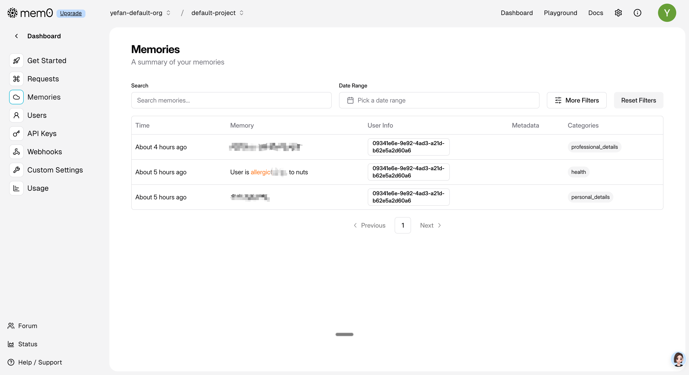

# Mem0 Dify Plugin v0.0.9

[](https://opensource.org/licenses/MIT)
[](https://dify.ai)
[](https://mem0.ai)

A comprehensive Dify plugin that integrates [Mem0 AI](https://mem0.ai)'s intelligent memory layer, providing **Local-only** tools with a unified client for self-hosted setups.



---

## 🌟 Features

### Complete Memory Management (8 Tools)
- ✅ **Add Memory** - Create memories with metadata and multi-entity support
- ✅ **Search Memory** - Search with advanced filters (AND/OR logic) and top_k limiting
- ✅ **Get All Memories** - List memories with pagination
- ✅ **Get Memory** - Fetch specific memory details
- ✅ **Update Memory** - Modify existing memories
- ✅ **Delete Memory** - Remove individual memories
- ✅ **Delete All Memories** - Batch delete with filters
- ✅ **Get Memory History** - View change history

### Advanced Capabilities
- 🖥️ **Local Mode Only** - Run with Local Mem0 (JSON-based config)
- 🧱 **Simplified Local Config** - 5 JSON blocks: LLM, Embedder, Vector DB, Graph DB (optional), Reranker (optional)
- 🎯 **Entity Scoping** - user_id (required for add), agent_id, run_id
- 📊 **Metadata System** - Custom JSON metadata for rich context
- 🔍 **Filters** - JSON filters supported by Mem0 local mode
- 🌍 **Internationalized** - 4 languages (en/zh/pt/ja)
 - ⚙️ **Async Mode Switch** - `async_mode` is enabled by default; Write ops (Add/Update/Delete) are non-blocking in async mode, Read ops (Search/Get) always wait; in sync mode all operations block until completion.

### What's New (v0.0.9)
- **Unified Return Format**: All tools return consistent JSON structure `{"status": "SUCCESS/ERROR", "messages": {...}, "results": {...}}`
- **Enhanced Async Operations**: Update, Delete, and Delete_All are now non-blocking in async mode, returning ACCEPT messages
- **Standardized Fields**:
  - Search/Get/Get_All: id, memory, metadata, created_at, updated_at
  - History: memory_id, old_memory, new_memory, event, created_at, updated_at, is_deleted
- **Extended Constants**: Added `UPDATE_ACCEPT_RESULT`, `DELETE_ACCEPT_RESULT`, `DELETE_ALL_ACCEPT_RESULT`
- **Complete Documentation**: All methods in mem0_client.py now have comprehensive docstrings
- **Async Mode Behavior**:
  - Write operations (Add/Update/Delete/Delete_All): non-blocking, return immediately with ACCEPT status
  - Read operations (Search/Get/Get_All/History): always wait for results
  - Sync mode: all operations block until completion

---

## 🚀 Quick Start

### Method 1: Install from GitHub (Recommended)

1. **In Dify Dashboard**
   - Go to `Settings` → `Plugins`
   - Click `Install from GitHub`
   - Enter your repository URL
   - Click `Install`

2. **Configure Provider Credentials (Local)**
   - In plugin settings, fill these JSON blocks:
     - Required: `local_llm_json`, `local_embedder_json`, `local_vector_db_json`
     - Optional: `local_graph_db_json`, `local_reranker_json`

3. **Start Using**
   - All 8 tools are now available in your workflows!

### Method 2: Install from Package

Download `mem0-0.0.9.difypkg` from [Releases](../../releases) and upload it manually in Dify.

---

## 📖 Usage Examples

### Basic Usage

#### Add a Memory (user_id required)
```json
{
  "user": "I love Italian food",
  "assistant": "Great! I'll remember that.",
  "user_id": "alex"
}
```

#### Search Memories
```json
{
  "query": "What food does alex like?",
  "user_id": "alex",
  "top_k": 5
}
```

### Add Memory with Metadata
```json
{
  "user": "I prefer morning meetings",
  "assistant": "Noted!",
  "user_id": "alex",
  "agent_id": "scheduler",
  "metadata": "{\"type\": \"preference\", \"priority\": \"high\"}"
}
```

### Search with Filters (local mode)
```json
{
  "query": "user preferences",
  "filters": "{\"AND\": [{\"user_id\": \"alex\"}, {\"agent_id\": \"scheduler\"}]}"
}
```

#### Get All Memories for an Agent
```json
{
  "agent_id": "travel_assistant",
  "limit": 50
}
```

---

## 🛠️ Available Tools

| Tool | Description |
|------|-------------|
| `add_memory` | Add new memories (user_id required) |
| `search_memory` | Search with filters and top_k |
| `get_all_memories` | List all memories |
| `get_memory` | Get specific memory |
| `update_memory` | Update memory content |
| `delete_memory` | Delete single memory |
| `delete_all_memories` | Batch delete memories |
| `get_memory_history` | View change history |

---

## 📚 Documentation

- **[CHANGELOG.md](CHANGELOG.md)** - Detailed changelog and examples
- **[INSTALL.md](INSTALL.md)** - Installation guide
- **[BUGFIX.md](BUGFIX.md)** - Known issues and fixes
- **[Mem0 Official Docs](https://docs.mem0.ai)** - Full API documentation

---

## 🎯 Use Cases

### Personal Assistant
```python
# Remember user preferences
add_memory("I prefer morning meetings", user_id="john")
add_memory("I'm vegetarian", user_id="john")

# Query preferences
search("when does john prefer meetings?", user_id="john")
```

### Customer Support
```python
# Track interactions
add_memory("Customer reported login issue", user_id="customer_123")

# Retrieve context
search("previous issues", user_id="customer_123")
```

### Multi-Agent Systems
```python
# Agent-specific memories
add_memory("User likes Italian food", agent_id="food_agent")
add_memory("User prefers Rome", agent_id="travel_agent")

# Search across agents
search(
    "user preferences",
    filters='{"OR": [{"agent_id": "food_agent"}, {"agent_id": "travel_agent"}]}'
)
```

---

## 🔧 Configuration

### Requirements
- Dify instance (self-hosted or cloud)
- Python 3.12+ (for local development)
- Dependencies: dify_plugin, httpx, openai, mem0, neo4j, psycopg2-binary

### Provider Credentials (Local Only)
- Required (paste JSON for each):
  - `local_llm_json`
  - `local_embedder_json`
  - `local_vector_db_json` (e.g., pgvector or pinecone)
- Optional:
  - `local_graph_db_json` (Neo4j)
  - `local_reranker_json`

### Async Mode
- `async_mode` (boolean, default: true)
  - When true (default):
    - Write operations (Add/Update/Delete/Delete_All): non-blocking, return ACCEPT status immediately
    - Read operations (Search/Get/Get_All/History): always wait for results
  - When false:
    - All operations block until completion

Example Vector DB JSON (pgvector):
```json
{
  "provider": "pgvector",
  "config": {
    "dbname": "dify",
    "user": "postgres",
    "password": "<password>",
    "host": "<host>",
    "port": "5432",
    "sslmode": "disable"
  }
}
```

---

## 🚀 Development

### Local Setup

1. **Clone the repository**
   ```bash
   git clone https://github.com/yourusername/dify-plugin-mem0.git
   cd dify-plugin-mem0
   ```

2. **Install dependencies**
   ```bash
   pip install -r requirements.txt
   ```

3. **Run locally**
   ```bash
   python -m main
   ```

### Testing

Run YAML validation:
```bash
for file in tools/*.yaml; do 
  python3 -c "import yaml; yaml.safe_load(open('$file'))" && echo "✅ $(basename $file)"
done
```

---

## 📊 Version History

| Version | Date | Changes |
|---------|------|---------|
| v0.0.9 | 2025-11-17 | Unified return format, enhanced async operations (Update/Delete/Delete_All non-blocking), standardized fields, extended constants, complete documentation |
| v0.0.8 | 2025-11-11 | async_mode credential (default true), sync/async tool routing, provider validation aligned, docs updated |
| v0.0.7 | 2025-11-08 | Local-only refactor, centralized constants, background event loop with graceful shutdown, non-blocking add (queued), search via background loop, normalized outputs |
| v0.0.4 | 2025-10-29 | Dual-mode (SaaS/Local), unified client, simplified Local JSON config, search top_k, add requires user_id, HTTP→SDK refactor |
| v0.0.3 | 2025-10-06 | Added 6 new tools, v2 API support, metadata, multi-entity |
| v0.0.2 | 2025-02-24 | Basic add and retrieve functionality |
| v0.0.1 | Initial | First release |

See [CHANGELOG.md](CHANGELOG.md) for detailed changes.

---

## 🤝 Contributing

Contributions are welcome! Please feel free to submit a Pull Request.

1. Fork the repository
2. Create your feature branch (`git checkout -b feature/AmazingFeature`)
3. Commit your changes (`git commit -m 'Add some AmazingFeature'`)
4. Push to the branch (`git push origin feature/AmazingFeature`)
5. Open a Pull Request

---

## 📝 License

This project is licensed under the MIT License - see the [LICENSE](LICENSE) file for details.

---

## 🙏 Acknowledgments

- [Dify](https://dify.ai) - AI application development platform
- [Mem0 AI](https://mem0.ai) - Intelligent memory layer for AI
- Built with ❤️ using Dify Plugin SDK

---

## 📞 Support

- **Issues**: [GitHub Issues](../../issues)
- **Documentation**: [Mem0 Docs](https://docs.mem0.ai)
- **Dify Docs**: [Plugin Development](https://docs.dify.ai/docs/plugins)

---

## ⭐ Show Your Support

If you find this plugin useful, please give it a ⭐ on GitHub!

---

### 🌟 Acknowledgments and Origin

This project is a **deeply modified and enhanced** version of the excellent [dify-plugin-mem0](https://github.com/Feversun/dify-plugin-mem0) project by **yevanchen**.

I sincerely appreciate the foundational work and outstanding contribution of the original author, yevanchen. The project provided a solid foundation for my localized, high-performance, and asynchronous plugin.

**Key Differences from the Original Project:**

The original project primarily supported Mem0 platform (SaaS mode) and synchronous request handling. This project has been fully refactored to include:
* **Local Mode**: Supports configuring and running the user's own LLM, embedding models, vector databases (e.g., pgvector/Milvus), graph databases, and more.
* **Asynchronous Support**: Utilizes asynchronous request handling, significantly improving performance and concurrency.

[Original Project Repository Link](https://github.com/Feversun/dify-plugin-mem0)
